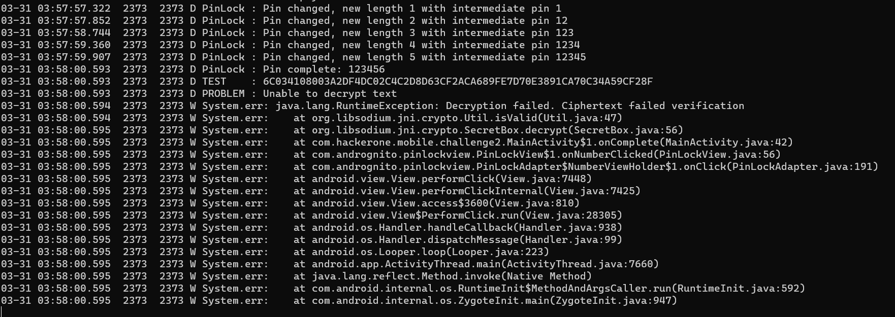
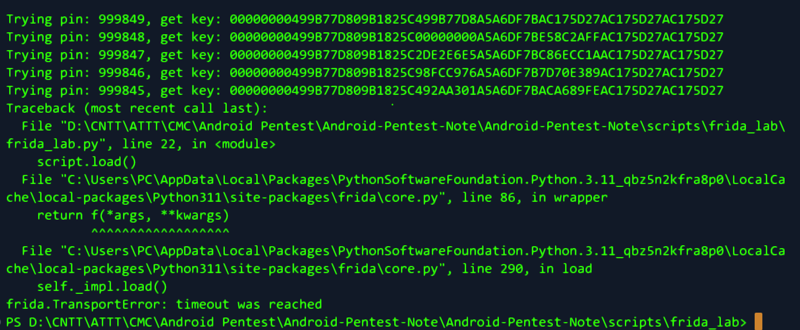
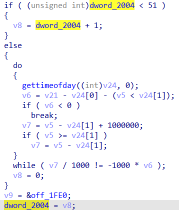
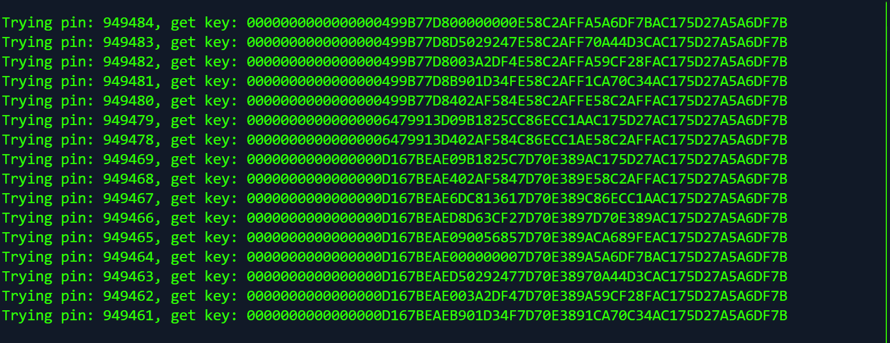

<div align='center'>

# **Frida**

</div>

## **1.  Set up Frida**

**Frida Client**

```zsh
python -m pip install frida-tools
```


**Frida Server**

Download the Frida server binary from [here](https://github.com/frida/frida/releases)

Extract the xz file to get the binary

Send the binary to the android emulator


Start the Frida server


Verify that the Frida server is running


## **2.  Frida Lab**

**Logcat output**



**Attempt 1**: Try to Brute force pin with this [hook script](./scripts/frida_lab/frida_labv1.py)

Get Timeout. This application is using a timeout to prevent brute force attack. 



Try with [setTimeout](./scripts/frida_lab/hook_scriptv2.js), It work but the brute force is too slow

**Attempt 2:** Use `resetCoolDown()`

Using IDA to reverse engineer the library using `resetCoolDown()` and `getKey()`, we can see that the `getKey()` function is implementing a brute force protection.



The `resetCoolDown()` function is used to reset the value of the counter in that brute force protection.    


Use [this hook script](./scripts/frida_lab/hook_scriptv3.js) to reset the counter and brute force the pin.

The program stop at 949461



Looking at the logcat output, we see global reference table overflow


So we need to run this script multiple times to get the pin

Finally, we use the `SecretBox()` class to find the correct pin: 918264

Script: [hook_scriptv4.js](./scripts/frida_lab/hook_scriptv4.js)


