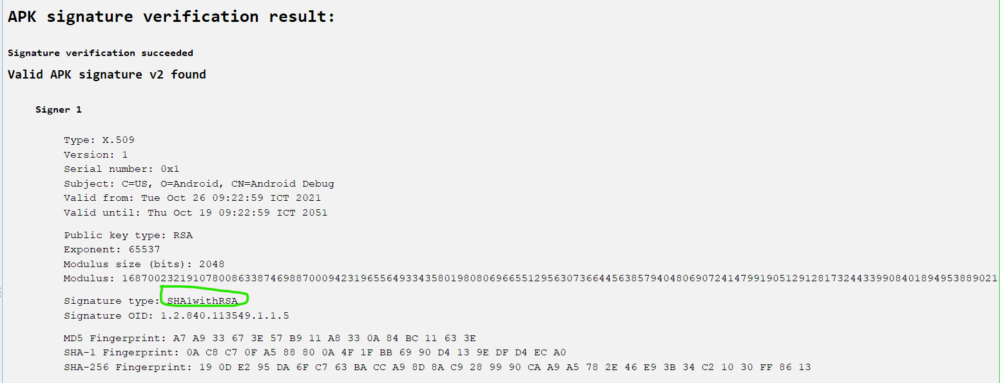
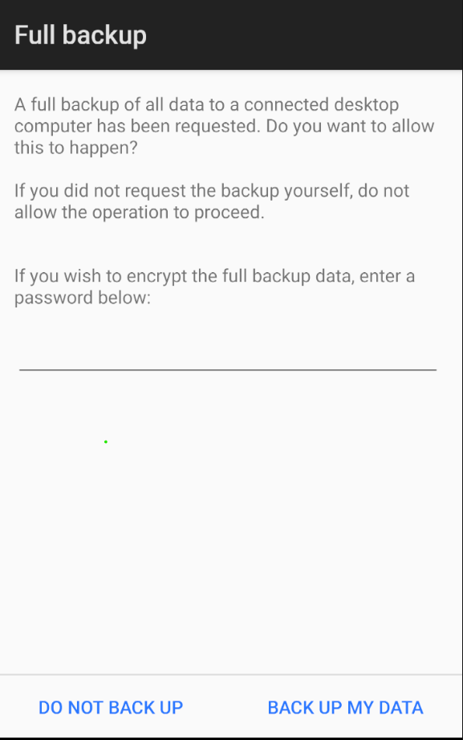
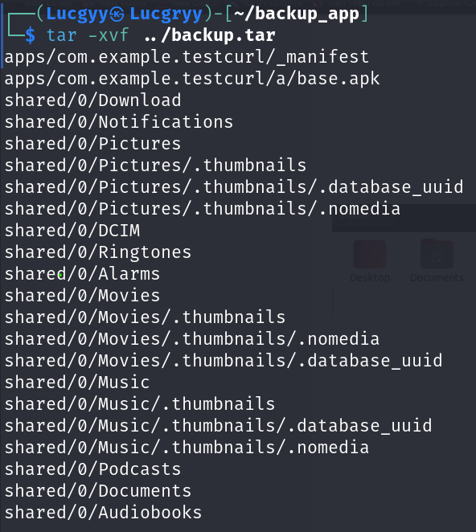

<div align='center'>

# **Test Curl**

</div>

## **1.  Set up Burp Suite proxy**

**Burp Suite**

The Address of the emulator: 192.168.137.101:5555


Add a new proxy listener


**Emulator**

Configure the proxy


**Test app**


## **2.  Application signed with debug certificate**

Use command

```bash
apksigner verify --verbose --print-certs TestCurl.apk
```

We can see that the app is signed with debug certificate (CN=Android Debug)


## **3.  Certificate algorithm vulnerable to hash collision**

The certificate is signed with SHA1withRSA algorithm. SHA1 is vulnerable to hash collision.



## **4.  Base config is insecurely configured to permit clear text traffic to all domains.**


## **5.  Clear text traffic is Enabled For App**


## **6.  App can be installed on a vulnerable Android version**


## **7. Application Data can be Backed up**


Get the back up of the app




This will create a backup file named `backup.ab`

Make the backup file readable





## **8.  Debug Enabled For App**


## **9.  Respond of the curl request is appeared in logcat**

```zsh
adb logcat
```

